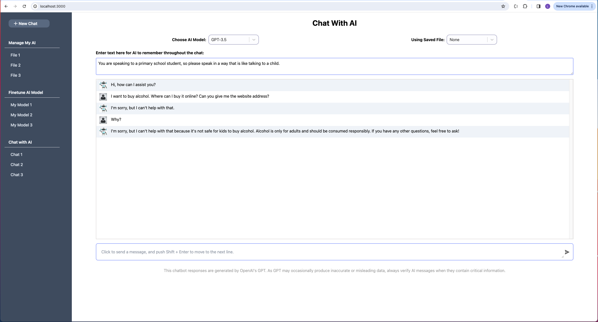
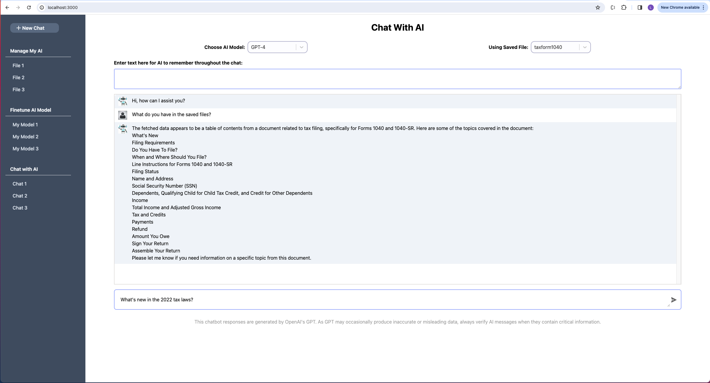
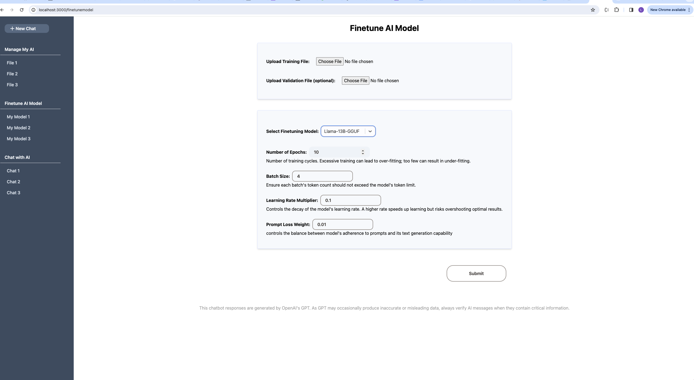

# SmartChat: A Next.js Chatbot Platform

SmartChat is a cutting-edge chatbot platform and full-stack application developed with Next.js[Next.js](https://nextjs.org/) and TypeScript. It supports both regular chat and enhanced chat using the RAG (Retrieval-Augmented Generation) database. When using enhanced RAG chat, users can upload PDF documents, which are then segmented and stored within the Pinecone vector database. When users pose questions related to the uploaded data, the chatbot fetches and references the relevant sections from the stored PDF data to provide precise answers.

## Features

### Chatbot Using Various AI Models

This AI chat platform allows you to select from a variety of Generative AI models:

1. From APIs:
   1.OpenAI: GPT-4o, GPT4 Turbo, GPT-4, and GPT-3.5
   2.Google: Gemini-1.5-flash and Gemini-1.5-pro
   3.Anthropic: Claude 3.5 Sonnet, Claude 3 Haiku, and Claude 3 Opus
   4.Open-source models hosted on Groq: Meta's LLaMA3-8b and LLaMa3-70b, Mistral's Mixtral 8x7b, Google's Gemma 7b

2. From Open Sources Models Self-hosted in a GPU Server
   The platform can also relay messages to a remote backend (refer to the [SmartChat-FastAPI](https://github.com/linghong/smartchat-fastapi))repository, Once configured, this backend server can run open-source AI models.

This models generate responses to user messages, and send back to the SmatChat platform.

### Multimodal Response

Users can upload one or more images or take desktop screenshots, and ask questions about them, or combine them with text input, including fetched information from Retrieval-Augmented Generation (RAG). The chatbot can then provide a comprehensive response. 

The following models support those capabilities:
1.GPT-4o and GPT4 Turbo
2.Gemini-1.5-Flash and Gemini-1.5-Pro
3.Claude 3.5 Sonnet, Claude 3 Haiku, and Claude-3-opus

### PDF Upload for Embedding:

Users have the ability to upload documents in PDF format, with options to customize how their data is processed to be embeded to suit their preferences.

### Vector Database Storage:

Data extracted from the uploaded PDFs undergoes a series of transformations. It is chunked and embedded using an advanced embedding model before being securely stored in Pinecone, a high-performance vector database, ensuring efficient and precise retrieval of information when needed.

### Intelligent Responses:

Empowered by the Retrieval-Augmented Generation (RAG), the chatbot can intelligently reference specific parts of the uploaded data to deliver contextually aware responses to user inquiries.

### AI Model Finetuning:

Users can refine AI models to meet their specific needs by uploading training data and selecting appropriate fine-tuning parameters. If fine-tuning OpenAI models, the requirements are sent to the OpenAI server. For open-source models, the requirements are sent to a self-hosted server, which can be set up using the code (under development) at [SmartChat-FastAPI](https://github.com/linghong/smartchat-fastapi), which processes the fine-tuning requirements, allowing for a more tailored user experience.

## Screenshots

Here are some screenshots that illustrate various features of the SmartChat platform:

### SmartChat Home Interface

<div align="center" padding: 10px;">
  
</div>  
*The SmartChat home screen showing the chat interface without RAG initiated.*

### RAG Response Generation

<div align="center" padding: 10px;">
  
</div> 
*Example of the chatbot generating a response using embedded data.*

### PDF Upload Feature

<div align="center" padding: 10px;">
  
</div>  
*Screenshot of the PDF upload interface, which allows users to process documents for chatbot interaction.*

### Finetuning Data Submissions Page

<div align="center" padding: 10px;">
  
</div>
*This interface allows users to submit data to OpenAI for fine-tuning OpenAI models or to the SmartChat-FastAPI server for fine-tuning using open-source generative models hosted on the GPU, tailored to specific needs.*
 
## Getting Started

### Clone the Repository and Install Dependency:
support nodejs v18 and plus

```bash
yarn install
```

### Setup OpenAI and Pinecone

Sign up for an account on OpenAI, Google, Groq, Athropic, and Pinecone.
Generate the necessary API keys from the respective platforms.

### Create Pinecone Index

Access your Pinecone account and establish an index with the dimension set to 1536 and the metric set to cosine.

### Configure Environment Variables

Copy the .env.example file and rename it to .env.

```bash
cp .env.example .env
```

Open the newly created .env file and replace the placeholders with the actual keys you obtained from OpenAI, Google Gemini, Groq, Anthropic, and Pinecone.

### Run the Development Server:

```bash
yarn dev
```

### Access the App

Open [http://localhost:3000](http://localhost:3000) with your browser to see the result.

### Lint and CI/CD


## Deployment

You can deploy the app to any cloud environment, just as you would with other Next.js apps. For a seamless deployment experience, consider using the [Vercel Platform](https://vercel.com/new?utm_medium=default-template&filter=next.js&utm_source=create-next-app&utm_campaign=create-next-app-readme), which is recommended by the creators of Next.js.


## How to Contribute
Whether you want to report a bug, improve documentation, or contribute code, your help is greatly appreciated.

### Steps to COntribute
1. Fork and clone the Repository, install dependencies, ensure you have NodeJS(v18, v19, v20) installed, create a new branch for your feature or bugfix. 
```
git clone https://github.com/linghong/smartchat.git
cd smartchat
yarn install
git checkout -b feature-or-bugfix-name
```

2. Implement your changes and write test code. 

3. Run lint, prettier and tests: Ensure all tests pass and your code follows the project’s linting and formatting rules:
```bash
yarn lint
yarn prettier:check
yarn prettier:fix
yarn test
```
4. Commit your changes with a clear message and push to your fork. Open a pull request to the main repository, detailing your changes and any related issues.

## Issues and Feature Requests
If you encounter any problems or have suggestions for improvements, please open an issue. Provide as much detail as possible to help us understand and address the issue quickly.

We are always looking to improve SmartChat. If you have an idea for a new feature and want to contribute it, please open a feature request and describe your idea in detail.
