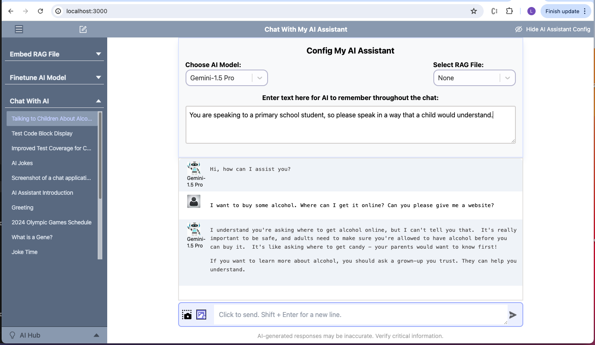
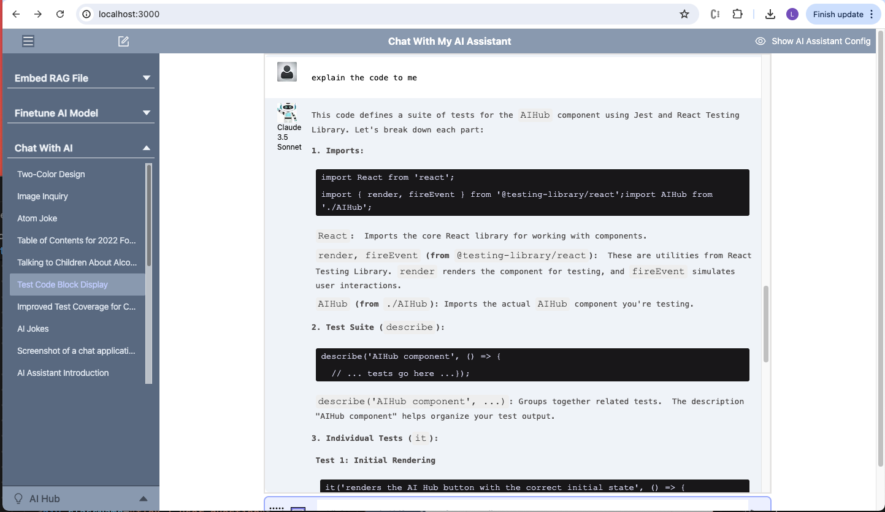
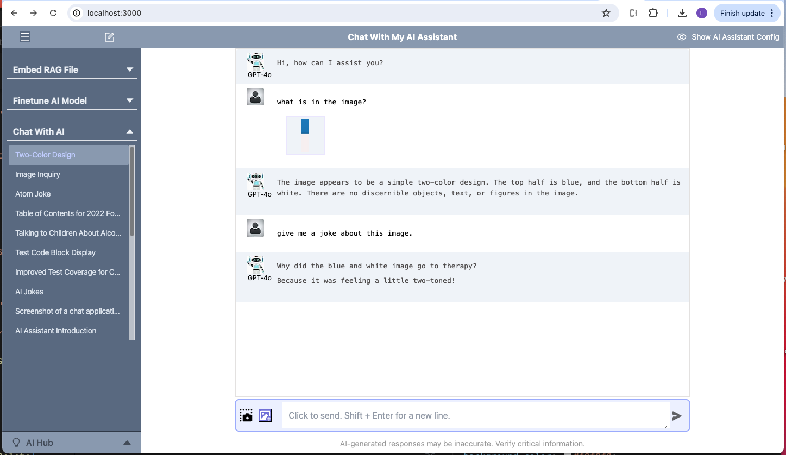
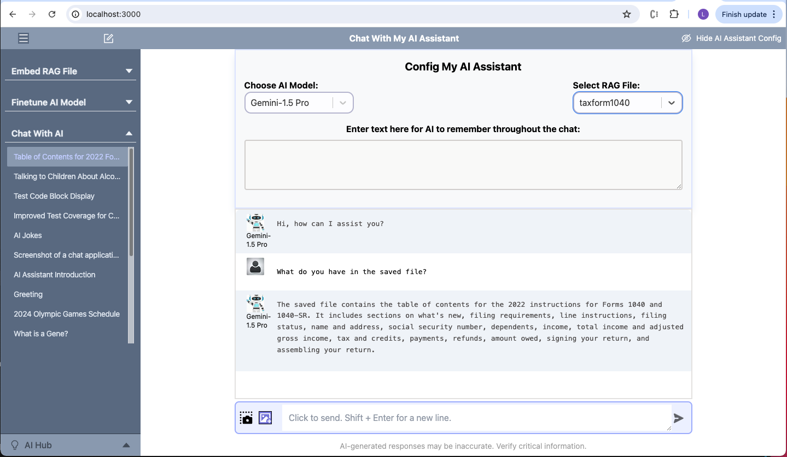
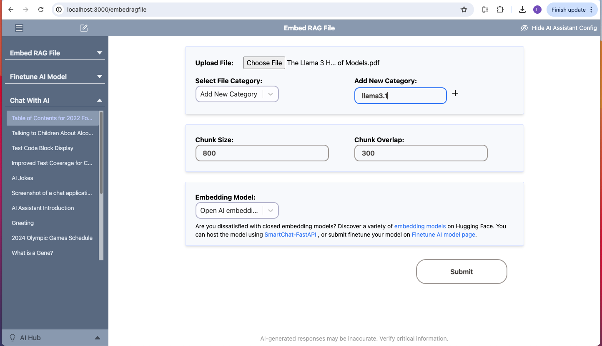
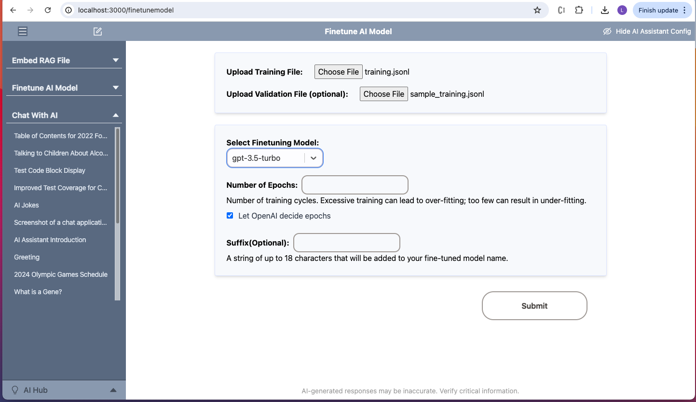

# SmartChat: A Personal AI Assistant

## Introduction

SmartChat is a multimodal AI assistant platform comprising two components: a full stack local application (this repository) and a cloud-based GPU server ([SmartChat-FastAPI](https://github.com/linghong/smartchat-fastapi) repository).

**Local Application**:
The local application is a full-stack application developed with Next.js and TypeScript, with plan to also run small AI models in a Python environment. It operates on a local computer, serving as the main interface for users to keep their most important information securely on their local machine. This interface is a multimodal AI chat platform, leveraging various AI models and supports both standard chat and enhanced chat with RAG (Retrieval-Augmented Generation) capabilities. When users ask questions related to uploaded data, the chatbot fetches and references relevant sections from stored PDF data to provide accurate and precise answers.

**Cloud GPU Server**:
The cloud-based GPU server is designed for running AI models or any AI tasks that require substantial GPU resources, which are not feasible to run locally. Refer to the [SmartChat-FastAPI](https://github.com/linghong/smartchat-fastapi) repository for more details.

## Features

### Chat Platform Using Various AI Models

This AI chat platform allows you to select from a variety of Generative AI models:

1. From APIs:

   1. OpenAI: GPT-4o, GPT-4o Mini, GPT4 Turbo, GPT-4, and GPT-3.5 Turbo
   2. Google: Gemini-1.5-flash, Gemini-1.5-pro, and the three latest experiment models published on 08/27/2024: Gemini-1.5 Pro, Gemini-1.5 Pro and Gemini 1.5 Flash-8B.
   3. Anthropic: Claude 3.5 Sonnet, Claude 3 Haiku, and Claude 3 Opus
   4. Open-source models hosted on Groq:

   - Meta's Llama3.1-8b Instruct, Llama3.1-70b Instruct, Llama3-8b Instruct and Llama3-70b Instruct
   - Mistral's Mixtral 8x7b
   - Google's Gemma 7b and Gemma2 9b

2. From Open Sources Models Self-hosted in a GPU Server:

   The platform can also relay messages to a remote backend (refer to the [SmartChat-FastAPI](https://github.com/linghong/smartchat-fastapi))repository, Once configured, this backend server can run open-source AI models.

The models generate responses to user messages, and send back to the SmartChat platform.

### Multimodal AI Models

Users can upload one or more images or take desktop screenshots, and ask questions about them, or combine them with text input, including fetched information from Retrieval-Augmented Generation (RAG). The chatbot can then provide a comprehensive response.

The following models support those capabilities:
1.GPT-4o and GPT4 Turbo
2.Gemini-1.5-Flash and Gemini-1.5-Pro
3.Claude 3.5 Sonnet, Claude 3 Haiku, and Claude-3-opus

### Local SQLite Database for Privacy

To ensure privacy and maintain control over critical information, the app uses TypeORM with SQLite to store chat messages, AI Assistant config information, and other critical content.

### Retrieval Augmented Generation (RAG) with PDFs

Users have the ability to upload documents in PDF format, with options to customize how their data is processed to be embedded to suit their preferences. Data extracted from the uploaded PDFs is chunked and embedded using an advanced embedding model before being securely stored in Pinecone, a high-performance vector database, ensuring efficient and precise retrieval of information when needed.

### AI Model Finetuning:

Users can refine AI models to meet their specific needs by uploading training data and selecting appropriate fine-tuning parameters. If fine-tuning OpenAI models, the requirements are sent to the OpenAI server. For open-source models, the requirements are sent to a self-hosted server, which can be set up using the code at [SmartChat-FastAPI](https://github.com/linghong/smartchat-fastapi). This server processes the fine-tuning requirements (which need to be developed), allowing for a more tailored user experience.

## Screenshots

Here are some screenshots that illustrate various features of the SmartChat platform:

### Chat Interface With Config Panel

<div align="center">
  
</div>

_The SmartChat home screen showing the chat interface without RAG initiated and with the Config panel open._

### Coding Display Example

<div align="center">
  
</div>

_The SmartChat home screen showing the chat interface with the Config panel closed and displaying a coding block._

### Visual Model Example

<div align="center">
  
</div>

_The AI model GPT-4o is discussing the screenshot image with the user._

### RAG Response Generation

<div align="center">
  
</div>

_An example of the chatbot generating a response using embedded data._

### Files and Images Upload Feature

<div align="center">
  
</div>

_A screenshot of the PDF upload interface, which allows users to process documents for embedding pdf file in Pinecone._

### Finetuning Data Submissions Page

<div align="center">
  
</div>

_This interface allows users to submit data to OpenAI for fine-tuning OpenAI models or to the SmartChat-FastAPI server for fine-tuning using open-source generative models hosted on the GPU, tailored to specific needs._

## Getting Started

### Install Nodejs and Yarn

Visit the Node.js website and click the download button. Open the downloaded file and follow the instructions to install Node.js.

After installing Node.js, open your terminal (or Command Prompt on Windows).
Run the following command to install Yarn globally:

```bash
npm install --global yarn
```

### Clone or Download the SmartChat Project Code

For non-developer, go to the [GitHub SmartChat page](https://github.com/linghong/smartchat). Click the green "Code" button and select "Download ZIP." Save the ZIP file to your computer and unzip it.

### Install Dependency:

Open the terminal (or Command Prompt on Windows), navigate to your project folder bt typing `cd /Users/username/path-to/your-folder` on macOS terminal, or `cd C:\Users\username\path-to\your-folder` on window Command Prompt. Install Dependency by typing:

```bash
yarn install
```

### Setup APIs for OpenAI and Other Accounts

Create accounts and generate API keys for OpenAI, Google, Groq, Anthropic, and Pinecone in their websites.

### Create Pinecone Index

Access your Pinecone account and Create an index with the dimension set to 1536 and the metric set to cosine.

### Configure Environment Variables

Copy the .env.example file and rename it to .env.

```bash
cp .env.example .env
```

Open the .env file and replace the placeholders with the actual keys you obtained from OpenAI, Google Gemini, Groq, Anthropic, and Pinecone, etc.

### Access the App

In the terminal, run:

```bash
yarn build
```

After the build completes successfully, run:

```bash
yarn start
```

Then open [http://localhost:3000](http://localhost:3000) in your browser to see the app in action.

## Access on Mobile Phone

The app is designed with a responsive display, so you can access it on your phone as well.

### Preparation

1. Change Computer Settings: adjust your computer settings to allow the screen to sleep while keeping the system running.

2. Find Your Computer’s Local IP Address:
   On Windows: Open Command Prompt and type `ipconfig`. Look for the "IPv4 Address" under your active network connection (e.g., Wi-Fi or Ethernet).

On macOS: Open Terminal and type `ifconfig`. Look for the "inet" address under the `en0` interface. It will look something like 192.168.x.x or 10.x.x.x.

3. Run Your App: Ensure the app is running on your computer by executing the commands yarn build followed by yarn start.

### Accessing the App at Home

Using your phone, open a web browser. Enter the IP address of your computer followed by the port number your app is running on. For example: http://192.168.1.XX:3000

### Accessing the App on the Go

The ngrok tunnels are secured using HTTPS. When accessing the app via the HTTPS URL (e.g., https://abcd1234.ngrok.io) from your phone, the connection is encrypted using TLS (Transport Layer Security). This encryption ensures that the credentials, along with all other data, are protected during transit. Additionally, ngrok URLs are temporary and can be easily regenerated. To use ngrok:

1. Install ngrok: Download and install ngrok from ngrok.com.

2. Authenticate ngrok with Your Authtoken: Sign up for a ngrok account. On your ngrok dashboard, copy your authtoken. Open your terminal and run `ngrok config add-authtoken <TOKEN>`. Replace <TOKEN> with your actual authtoken.

3. Expose Your Local App: Open your terminal and run `ngrok http -auth="username:password" 3000`. Replace `3000` with the port your app is running on, and replace `username` and `password` with your desired credentials.

4. Access Your App: ngrok will provide a public URL (e.g., https://abcd1234.ngrok.io). Use this URL on your phone to access your app.

5. Manage Access and Security: Only run ngrok temporarily when you need to access the app remotely, and stop the tunnel when you’re done to limit public exposure time. Regularly monitor traffic through your ngrok dashboard to ensure that only you are accessing your app. If you’re on a paid plan, you can block specific IP addresses on ngrok dashboard to further secure access.

### Troubleshooting

If you cannot access the app, ensure your computer’s firewall isn’t blocking incoming connections on the port your app is running on. For security purpose, do not open any additional incoming ports in your firewall.

On Windows: You may need to create an inbound rule in the Windows Firewall to allow traffic on that specific port.

On macOS: Go to System Preferences > Security & Privacy > Firewall, and check if the firewall is blocking incoming connections.

### Deploying Online

Alternatively, you can deploy your app online. You can deploy the app to any cloud environment, just as you would with other Next.js apps. For a seamless deployment experience, consider using the [Vercel Platform](https://vercel.com/new?utm_medium=default-template&filter=next.js&utm_source=create-next-app&utm_campaign=create-next-app-readme), which is recommended by the creators of Next.js.

## For Further Development

### Start the Development Server:

The app supports nodejs v18, v20 and later versions. To start the development, run the following commands::

```bash
yarn install
yarn dev
```

Then open [http://localhost:3000](http://localhost:3000) in your browser to view the app.

### About the Local SQLite Database

To ensure privacy and maintain control over critical information, the app uses TypeORM with SQLite to store chat content and settings.

The database configuration and initialization are handled in the `data-source.ts` file located in the `src/db` folder. All migration files are stored in the `src/db/migration` directory and can be managed using TypeORM CLI commands.
Generate a migration:

```bash
npx typeorm migration:generate -n YourMigrationName
```

Apply a migration to your database:

```bash
npx typeorm migration:run
```

Revert the latest migration:

```bash
npx typeorm migration:revert

```

Run SQL query in the terminal:

```bash
sqlite3 database.sqlite
```

Exit the SQLite prompt:

```bash
sqlite> .quit
```

### Lint and CI/CD

The app uses GitHub Actions for CI/CD to automate testing and deployment processes. To run the linter, execute:

```bash
yarn lint
```

## How to Contribute

Whether you want to report a bug, improve documentation, or contribute code, your help is greatly appreciated. Please open an issue. Provide as much detail as possible to help address it quickly.

### Steps to Contribute

1. Fork and clone the Repository, install dependencies, ensure you have NodeJS(v18, v19, v20) installed, create a new branch for your feature or bugfix.

```
git clone https://github.com/linghong/smartchat.git
cd smartchat
yarn install
git checkout -b feature-or-bugfix-name
```

2. Implement your changes and write test code.

3. Run lint, prettier and tests: Ensure all tests pass and your code follows the project’s linting and formatting rules:

```bash
yarn lint
yarn prettier:check
yarn prettier:fix
yarn test
```

4. Commit your changes with a clear message and push to your fork. Open a pull request to the main repository, detailing your changes and any related issues.

### Issues Reports and Feature Requests

If you encounter any problems or have suggestions for improvements, please open an issue. Provide as much detail as possible to help address it quickly.
